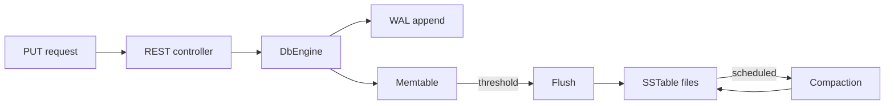

# CraftDB

CraftDB is a small, educational **key–value storage engine** inspired by **LSM-tree** designs. It is implemented in **Java 21** and wrapped in **Spring Boot** so you can experiment with durability, flushing, and compaction through a simple HTTP API.

This repository is meant for learning how real databases layer **WAL → memtable → on-disk tables**—not as a production datastore.

## Features

- **Write-ahead log (WAL)** for durability; entries are replayed on startup to rebuild in-memory state.
- **Memtable** backed by a concurrent sorted map (`ConcurrentSkipListMap`).
- **Automatic flush** when the memtable crosses a size threshold, producing append-only **SSTable** files (length-prefixed key/value records).
- **Background compaction** on a timer: when enough SSTables exist, they are merged into one file (last write wins per key).
- **Read/write locking** around engine mutations and reads.
- **Optional conceptual sharding** (`ShardedDbEngine`) routing keys to multiple engines by hash (not wired to the HTTP API).

## Stack

- Java **21**
- Spring Boot **3.5** (`spring-boot-starter-web`, Actuator)
- Gradle (**wrapper** included)

## Quick start

Prerequisites: **JDK 21**.

```bash
./gradlew bootRun
```

The app listens on the default Spring Boot port (**8080**). Data files are written under **`data/`** in the working directory (WAL: `data/craftdb.wal`, SSTables: `data/sstable-*.db`).

### HTTP API

| Method | Path | Description |
|--------|------|-------------|
| `PUT` | `/api/craft/{key}?value=...` | Store a string value for `key` |
| `GET` | `/api/craft/{key}` | Read the value for `key` |

Examples:

```bash
curl -X PUT "http://localhost:8080/api/craft/user:1?value=alice"
curl "http://localhost:8080/api/craft/user:1"
```

### Tests

```bash
./gradlew test
```

## Architecture (high level)



On startup, the engine **recovers** by reading the WAL into a fresh memtable.

## Project layout

```
src/main/java/com/craftdb/craftdb/
  CraftdbApplication.java      # Spring Boot entrypoint
  api/CraftController.java     # REST API
  engine/                      # Memtable, DbEngine, compaction, sharding sketch
  storage/                     # WAL, SSTable reader/writer
```

`course.md` captures a longer **theory + build plan** narrative that motivated this project.

## Current limitations (by design / roadmap)

- **Read path** today resolves keys from the **active (and frozen) memtable**; **SSTables are not consulted on `GET`** yet, so values that exist only on disk after a flush may not be visible until that behavior is implemented.
- WAL **truncation / checkpointing** after successful flush is not implemented (noted in code comments).
- WAL lines use a simple `key,value` text format: keys/values should avoid raw commas in this prototype.
- Compaction loads merged inputs into memory; a production engine would use a streaming **k-way merge**.

## License

No license file is included in this repository yet. Add one (for example MIT or Apache-2.0) before publishing if you intend others to reuse the code.
